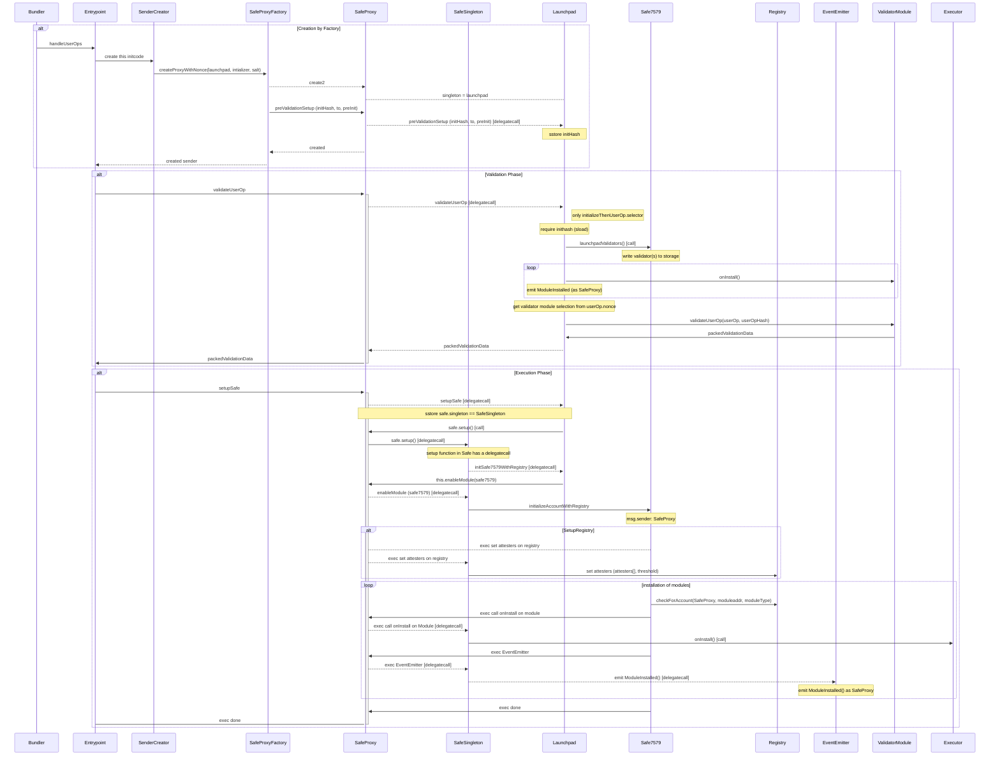
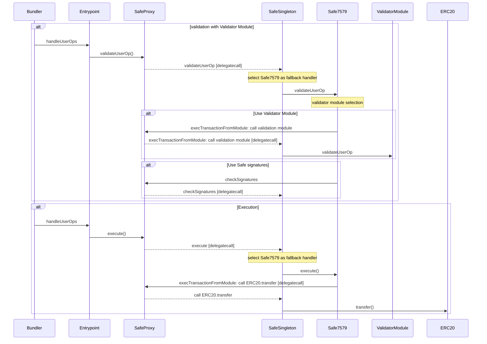

## How Safe7579 works

Safe7579 provides full `ERC4337` and `ERC7579` compliance to Safe accounts by serving as the Safe's `FallbackHandler` and an enabled module. This setup allows Safe accounts to utilize all `ERC7579` modules. A launchpad is developed to facilitate the setup of new safes with Safe7579 using the EntryPoint factory.

## How does the Launchpad work

1. **Creation by Factory:**

   - Bundler informs `Entrypoint` to handleUserOps.
   - Entrypoint calls `SenderCreator` to call `SafeProxyFactory`
   - `SenderCreator` requests safeProxy creation from `SafeProxyFactory` using createProxyWithNonce.
   - `SafeProxyFactory` creates a new `SafeProxy` using `create2`.
   - `SafeProxy` is created with a singleton address set to `Launchpad` (!)
   - `InitHash` is stored in the `SafeProxy` storage

2. **Validation Phase:**

   - `Entrypoint` validates user operations in `SafeProxy` via `validateUserOp`.
   - `SafeProxy` delegates validation to `Launchpad`.
   - `Launchpad` ensures the presence of initHash from phase 1 and calls `Safe7579.launchpadValidators`
   - `ValidatorModule` gets installed by `Launchpad`
   - `ValidatorModule` validates user operations and returns `packedValidationData`
   - `Launchpad` returns packedValidationData to `SafeProxy`, `SafeProxy` returns to `Entrypoint`

3. **Execution Phase:**
   - `Entrypoint` triggers `launchpad.setupSafe()` in `SafeProxy`
   - `SafeProxy` delegates the setup to `Launchpad`
   - `LaunchPad` upgradres `SafeStorage.singleton` to `SafeSingleton`
   - `LaunchPad` calls `SafeProxy.setup()` to initialize `SafeSingleton`
   - Setup function in `SafeProxy.setup()` delegatecalls to `lauchpad.initSafe7579`
   - `initSafe7579()` initilazies `Safe7579` with executors, fallbacks, hooks, `IERC7484` registry

This detailed sequence outlines the creation, validation, and execution phases in the system's operation.

Special thanks to [@nlordell (Safe)](https://github.com/nlordell), who came up with [this technique](https://github.com/safe-global/safe-modules/pull/184)

## How do validations and executions work

In order to call module logic or interact with external contracts, all calls have to be routed over the SafeProxy.
The Safe7579 adapter is an enabled Safe module on the Safe Account, and makes use for `execTransactionFromModule`, to call into external contracts as the Safe Account.

In order to select validator modules, the address of the validator module can be encoded in the userOp.nonce key. If an validator module that was not previously installed, or validator module with address(0) be selected, the Safe's `checkSignature` is used as a fallback.

## Batched Executions

Safe Account's `execTransactionFromModule` do not natively offer the ability to batch multiple calls into a single transaction. Yet one of the core feature of ERC7579 is the ability to validate and make batched executions.
To save Gas, instead of calling `execTransactionFromModule` n times, we are making use of a special multicall contract, that will be delegatecalled by the Safe account.
The same contract is also used, to emit events for onInstall / onUninstall of modules.

## Installation of Modules

## Authors / Credits✨

Thanks to the following people who have contributed to this project:

<!-- ALL-CONTRIBUTORS-LIST:START - Do not remove or modify this section -->
<!-- prettier-ignore-start -->
<!-- markdownlint-disable -->
<table>
  <tr>
    <td align="center"><a href="http://twitter.com/zeroknotsETH/"> <b>zeroknots (rhinestone)</b></a> <a href="https://github.com/zeroknots" title="Code">💻</a></td>

<td align="center"><a href="https://twitter.com/abstractooor"> <b>Konrad (rhinestone)</b></a> <a href="https://github.com/kopy-kat" title="Spec">📝</a> </td>

<td align="center"><a href="https://twitter.com/NLordello"> <b>Nicholas Rodrigues Lordello (Safe)
</b></a> <a href="https://github.com/ nlordell" title="Review / Launchpad Idea">📝</a> </td>

  </tr>
</table>

Special Thanks to the Safe Team for their support and guidance in the development of Safe7579.
