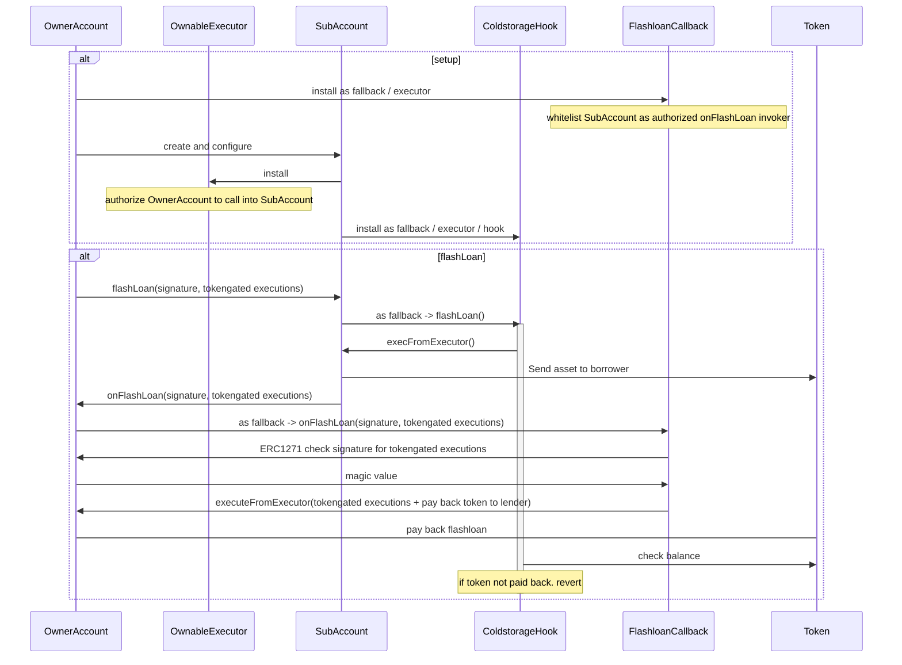

```mermaid
sequenceDiagram
participant OwnerAccount
participant OwnableExecutor
participant SubAccount
participant ColdstorageHook
participant FlashloanCallback
participant Token


alt setup
OwnerAccount->>FlashloanCallback: install as fallback / executor
Note over FlashloanCallback: whitelist SubAccount as authorized onFlashLoan invoker
OwnerAccount->>SubAccount: create and configure
SubAccount->>OwnableExecutor: install
Note over OwnableExecutor: authorize OwnerAccount to call into SubAccount
SubAccount->> ColdstorageHook: install as fallback / executor / hook
end

alt flashLoan
OwnerAccount->>SubAccount: flashLoan(signature, tokengated executions)
SubAccount->>ColdstorageHook: as fallback -> flashLoan()
activate ColdstorageHook
ColdstorageHook->>SubAccount: execFromExecutor()
SubAccount->>Token: Send asset to borrower
SubAccount->>OwnerAccount: onFlashLoan(signature, tokengated executions)
OwnerAccount->>FlashloanCallback: as fallback -> onFlashLoan(signature, tokengated executions)
FlashloanCallback->>OwnerAccount: ERC1271 check signature for tokengated executions
OwnerAccount->>FlashloanCallback: magic value
FlashloanCallback->>OwnerAccount: executeFromExecutor(tokengated executions + pay back token to lender)
OwnerAccount->Token: pay back flashloan
ColdstorageHook->>Token: check balance
Note over ColdstorageHook: if token not paid back. revert
deactivate ColdstorageHook

end
```
