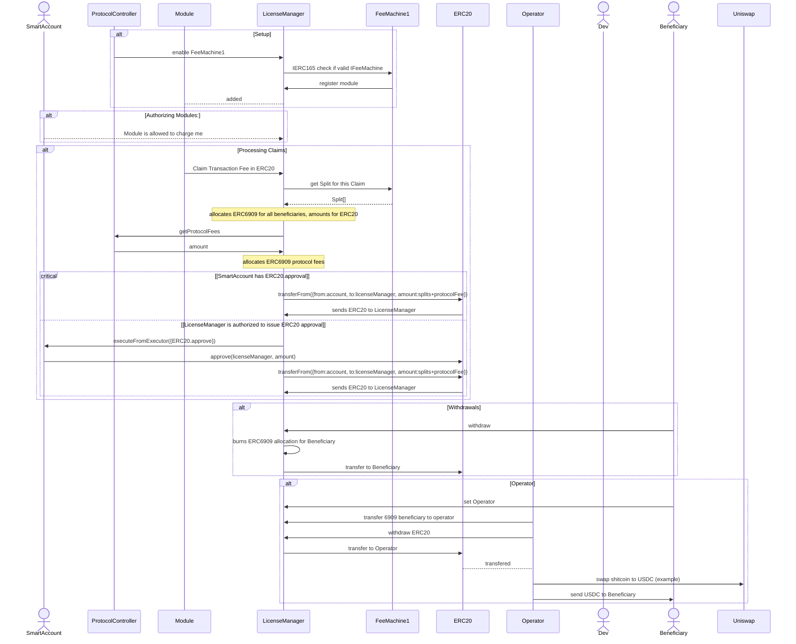

# LicenseManager

```mermaid
sequenceDiagram
actor SmartAccount
participant ProtocolController
participant Module
participant LicenseManager
participant FeeMachine1
participant ERC20
participant Operator

actor Dev
actor Beneficiary

alt Setup
ProtocolController ->> LicenseManager: enable FeeMachine1
LicenseManager ->> FeeMachine1: IERC165 check if valid IFeeMachine
FeeMachine1 ->> LicenseManager: register module
LicenseManager --> Module: added
end

alt Authorizing Modules:
SmartAccount -->> LicenseManager: Module is allowed to charge me
end

alt Processing Claims
Module ->> LicenseManager: Claim Transaction Fee in ERC20
LicenseManager ->> FeeMachine1: get Split for this Claim
FeeMachine1 -->> LicenseManager: Split[]
Note over LicenseManager: allocates ERC6909 for all beneficiaries, amounts for ERC20
LicenseManager ->>ProtocolController: getProtocolFees
ProtocolController->>LicenseManager: amount
Note over LicenseManager: allocates ERC6909 protocol fees

critical [SmartAccount has ERC20.approval]
LicenseManager->>ERC20: transferFrom({from:account, to:licenseManager, amount:splits+protocolFee})
ERC20->>LicenseManager: sends ERC20 to LicenseManager
option [LicenseManager is authorized to issue ERC20 approval]
LicenseManager->>SmartAccount: executeFromExecutor({ERC20.approve})
SmartAccount->>ERC20: approve(licenseManager, amount)
LicenseManager->>ERC20: transferFrom({from:account, to:licenseManager, amount:splits+protocolFee})
ERC20->>LicenseManager: sends ERC20 to LicenseManager
end
end

alt Withdrawals
Beneficiary->> LicenseManager: withdraw
LicenseManager->>LicenseManager: burns ERC6909 allocation for Beneficiary
LicenseManager->>ERC20: transfer to Beneficiary
end

alt Operator
Beneficiary->>LicenseManager: set Operator
Operator->>LicenseManager: transfer 6909 beneficiary to operator
Operator->>LicenseManager: withdraw ERC20
LicenseManager->>ERC20: transfer to Operator
ERC20-->Operator: transfered
Operator->>Uniswap: swap shitcoin to USDC (example)
Operator->>Beneficiary: send USDC to Beneficiary
end

```
