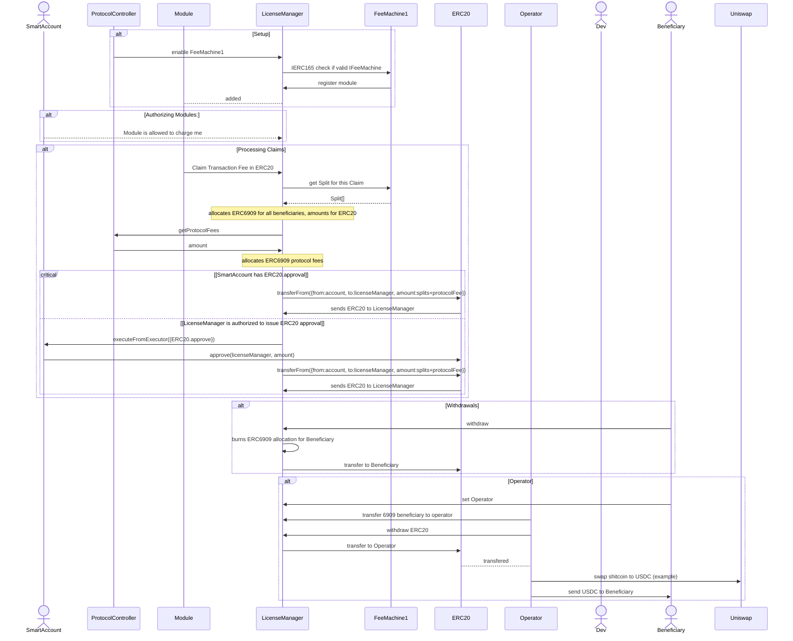

# LicenseManager

LicenseManager is a vital component of the Rhinestone protocol, serves as a core mechanism for enabling developers of smart account modules to implement a range of paid business models. Among its functionalities, LicenseManager supports various business models such as subscriptions, lifetime licenses, pay-per-use, and a percentage of transaction fees. This flexibility empowers developers to monetize their module logic effectively within the ecosystem.
The workflow of LicenseManager is structured to streamline fee claiming and equity distribution processes. Upon authorization by a smart account, LicenseManager facilitates fee claims by modules and interfaces with external entities, such as the IFeeMachine, to determine the equitable distribution of fees collected. This seamless interaction ensures transparent and fair revenue sharing among developers, auditors, and other stakeholders within the ecosystem, fostering trust and collaboration.

## Accounting

In the realm of token management, LicenseManager employs ERC20 tokens for fee transactions and holds a percentage of these tokens on its address to facilitate fee distributions. Additionally, the smart contract leverages ERC6909, an ERC1155 semi-fungible token replacement, for precise accounting and allocation of equity shares. Through the issuance of ERC6909 tokens to beneficiaries based on predetermined equity splits, LicenseManager ensures accurate and secure tracking of each party's entitlements within the ecosystem.
Beneficiaries of equity shares have the autonomy to manage their token balances through withdrawal or delegation using ERC6909 operators. This feature enhances user control and flexibility, empowering stakeholders to make informed decisions regarding their token holdings and interactions within the ecosystem. Furthermore, LicenseManager's immutable nature and restrictions on owner privileges, such as minting ERC6909 tokens or initiating ERC20 transfers on behalf of users, uphold the principles of trustlessness and permissionlessness, safeguarding the integrity of operations within the protocol.

## FeeMachines

The FeeMachines play a critical role within the LicenseManager ecosystem by serving as an external contract responsible for determining the equitable split of fees collected from module claims. When modules claim fees on LicenseManager, these claims are forwarded to the FeeMachine, which collaborates with various entities, including developers, auditors, and other stakeholders, to establish a fair distribution of revenue. The FeeMachine returns an array of (beneficiary, amount) tuples, outlining the specific beneficiaries and their corresponding share of the fees. This collaborative process ensures transparency and accuracy in fee allocation, promoting a harmonious and equitable revenue-sharing mechanism within the Rhinestone protocol.

## Referrals

A notable feature of LicenseManager is its referral fee system, which allows decentralized applications (DApps) to earn kickback referral fees when utilizing a module. This incentivizes collaboration and promotes the adoption of modules by rewarding participants in the ecosystem for their contributions. By incorporating this referral fee system, LicenseManager enhances the overall engagement and monetization opportunities for developers and users alike.

## Swap Operators

The operator component, an upcoming feature within the Rhinestone protocol, is designed to facilitate token swaps for fee beneficiaries who opt-in to the service. By periodically executing token conversions, the operator component enables seamless transitions of tokens to the desired target token, such as a stablecoin. This functionality aims to enhance the efficiency and flexibility of token management within the ecosystem, offering users a convenient mechanism to optimize their token holdings. With the introduction of the operator component, Rhinestone further expands its ecosystem capabilities, providing users with enhanced control and versatility in managing their token assets across various payment modalities and use cases.

## LicenseManager as an Executor

LicenseManager introduces a unique feature wherein it can be installed on smart accounts as an ERC7579 executor, enabling the payment of License Fees in native tokens or executing ERC20 approvals on behalf of the smart account. This opt-in functionality enhances user experience by streamlining payment processes and facilitating interactions with various assets within the ecosystem. By leveraging this feature, smart accounts can automate ERC20 approvals for efficient asset management, eliminating the need for manual approval for each asset involved in module interactions. Moreover, the system ensures that ERC20 approvals are dynamically adjusted "just in time" when a claim occurs, optimizing the approval process and preventing excessive approvals. Additionally, LicenseManager supports the seamless transacting and handling of native assets, including Ether (ETH), further expanding the versatility and utility of the platform for users interacting with different asset types within the Rhinestone ecosystem.

## Sequence Diagram

