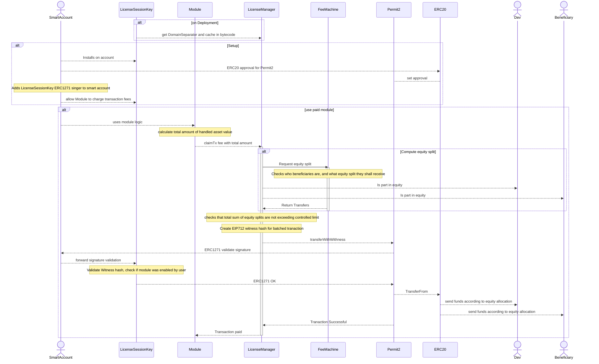
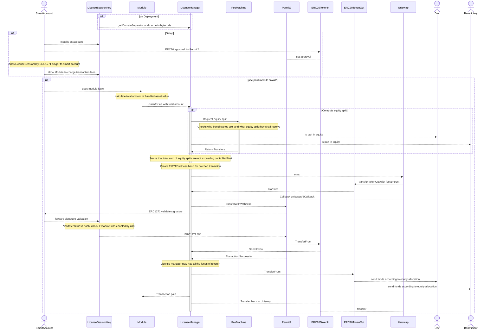

# License Manager

License Manager is making use or Uniswap's Permit2 and ERC1271 to enable a smart account to pay for transaction fees and module usage.

## Fee Machines

Fee Machines are external contracts that can be used to calculate equity splits and other fee related calculations.

### Subscription

### Pay per use

### Transaction Fee

## Payments

## Payments with Swap

